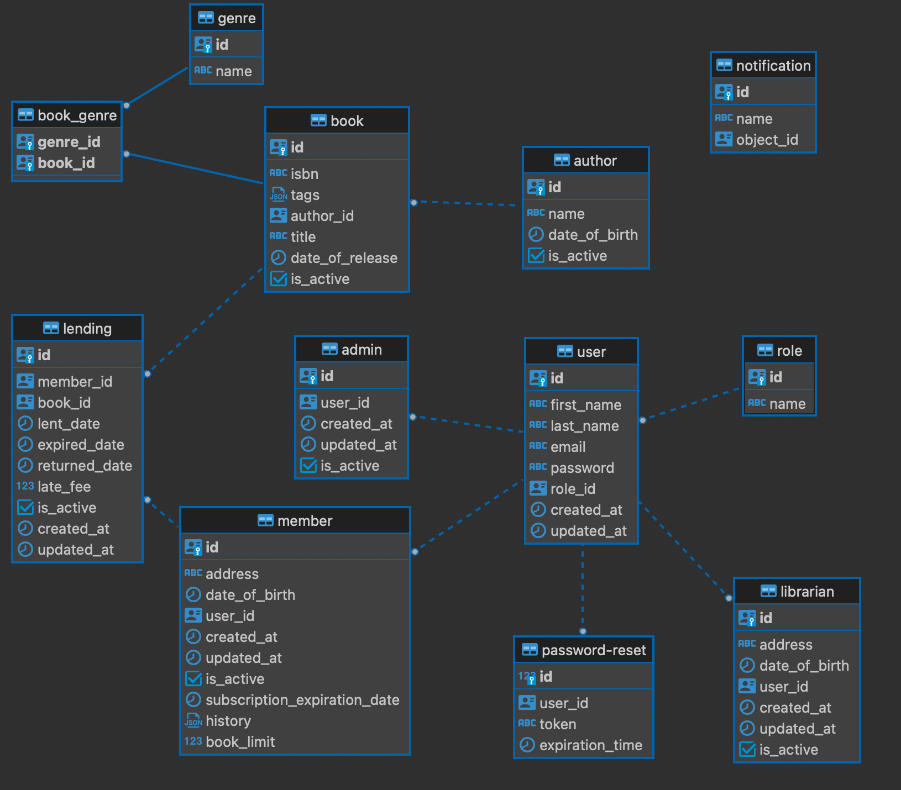

# Library Management API

[NodeJs]: https://img.shields.io/badge/node.js-6DA55F?style=for-the-badge&logo=node.js&logoColor=white
[NodeJs-url]: https://nodejs.org/en/docs/
[Jest]: https://img.shields.io/badge/-jest-%23C21325?style=for-the-badge&logo=jest&logoColor=white
[Jest-url]: https://jestjs.io/
[Postgres]: https://img.shields.io/badge/postgres-%23316192.svg?style=for-the-badge&logo=postgresql&logoColor=white
[Postgres-url]: https://www.postgresql.org/docs/
[Sequelize-ORM]: https://img.shields.io/badge/Sequelize-52B0E7?style=for-the-badge&logo=Sequelize&logoColor=white
[Sequelize-url]: https://sequelize.org/
[Docker]: https://img.shields.io/badge/docker-%230db7ed.svg?style=for-the-badge&logo=docker&logoColor=white
[Docker-url]: https://docs.docker.com/
[React]: https://img.shields.io/badge/react-%2320232a.svg?style=for-the-badge&logo=react&logoColor=%2361DAFB
[React-url]: https://reactjs.org/

 [![NodeJs]][Nodejs-url]  [![Postgres]][Postgres-url] [![Sequelize-ORM]][Sequelize-url] [![Docker]][Docker-url] [![Jest]][Jest-url] [![React]][React-url]

## Table of Contents
- [Description](#description)
  - [About application](#about-application)
  - [Built with](#built-with)
- [Getting Started](#getting-started)
  - [Prerequisites](#prerequisites)
  - [Run the project](#run-the-project)
  - [Run tests with Jest](#run-tests-with-jest)
- [Structure](#structure)
- [Database](#database)


## Description
### About application
This application is built for library management and administration purposes.

Users:
- Each user will be authorized using JWT
- There are three different types of users: admin, librarian and member 
- After members are created, their membership starts and every membership renewal is saved to membership history
- Members can view their own user info
- Administrators/librarians can create, update, delete and fetch members

Books:
- Fetching books is available for both registered and unregistered users
- Librarians (and admins) can also create, update, delete and fetch all books in the system
- Creating books can be creating manually or loaded using ISBN code through Google Books API 
- Books can be filtered by title, author, year of release (time span), genre and tags

Book lending: 
- Member has to be subscribed to be able to lend books
- Member can lend a limited number of books at one time
- For every lending, an expiration date is set and if a member doesn't return a book on time, a late fee will be charged
- Admins and librarians can create, update, delete and fetch book lendings for all users and for a specific user 
- Member can only view their own book lendings, including currently lent books and lending history

Email notifications:
- Membership email notifications should be sent to the member one week before their membership expires, one day before and on a day when their membership expired
- Due date email notifications should be sent to the member one day before due date, on due date and once every day until the book is returned (those emails will also contain information about the fee that will be charged)

### Built with
This is a REST API for Library management created with: 
- **Framework** - [Node.js](https://nodejs.org/en/docs/)
- **Database** - [PostgreSQL](https://www.postgresql.org/docs/) 
- **ORM** - [Sequelize](https://sequelize.org/docs/v6/)
- **Virtualization** - [Docker](https://docs.docker.com/)
- **Tests** - [Jest](https://jestjs.io/docs/getting-started)
- **Library** - [React](https://reactjs.org/)

## Getting Started

### Prerequisites
- install [Node](https://nodejs.org/en/download/)
- install [Docker](https://www.docker.com/) 
### Run the project

1. Clone GitHub repository:
   ```
   git@github.com:agilathon/library_management.git
   ```

#### Start backend application

1. Open ```server``` folder

2. Create a `.env` file based on `.env.example` file:
    ```
    NODE_ENV=development
    PORT=port
    SECRET_KEY=secret
    EXPIRES_IN=expiration_time
    NOTIFICATION_MAILER_HOST=host_address
    NOTIFICATION_MAILER_PORT=mail_server_smtp_port
    CRON_SCHEDULE=scheduled_time
    DB_HOST=db_host_address
    DB_PORT=db_port
    DB_USERNAME=username
    DB_PASSWORD=password
    GOOGLE_BOOKS_API_URL=https://www.googleapis.com/books/v1/volumes
    ```
3. Start the project:
   ```
   docker-compose up -d
   ```
   - this command generates the database, sets up the mail service and starts the application
   - after running this command, one admin user is created with credentials:
   email: ```admin@gmail.com``` password: ```admin```
   

    

##### Run tests with Jest
1. Run tests:
    ```
    npm run test
    ```
#### Start frontend application

1. Open ```client``` folder

2. Install all packages:
   ```
   npm install --legacy-peer-deps
   ```
  - ```--legacy-peer-deps``` is used because ``` @mui/styles``` has not updated dependency list for ```react v18```

3. Create a `.env` file based on `.env.example` file:
    ```
    REACT_APP_SERVER_URL="http://localhost:{{BACKEND_PORT}}/api/v1"
    REACT_APP_BASE_URL="http://localhost:{{FRONTEND_PORT}}"
    REACT_APP_ADMIN_ROLE="admin_uuid"
    REACT_APP_LIBRARIAN_ROLE="librarian_uuid"
    ```
4. Start the project
    ```
    npm run start
    ```
## Structure
```
├── README.md
├── client
│   ├── build
│   ├── node_modules
│   ├── package-lock.json
│   ├── package.json
│   ├── public
│   └── src
├── db.png
└── server
    ├── Dockerfile
    ├── app.js
    ├── controllers
    ├── database
    ├── docker-compose.yml
    ├── index.js
    ├── jest.config.js
    ├── middleware
    ├── node_modules
    ├── package-lock.json
    ├── package.json
    ├── routes
    ├── services
    ├── swagger-output.json
    ├── swagger.js
    ├── tests
    └── utils
```

## Database


​
<h2>Code Contributors</h2>
 
 - [Lucija Banek](https://github.com/lucijabanek)

 - [Lovre Begović](https://github.com/lb46861)
 
 - [Lucija Bilić](https://github.com/lucija-bilic)

​
<h2>Mentor</h2>
 
 - [Marko Radovčić](https://github.com/radovcicmarko)